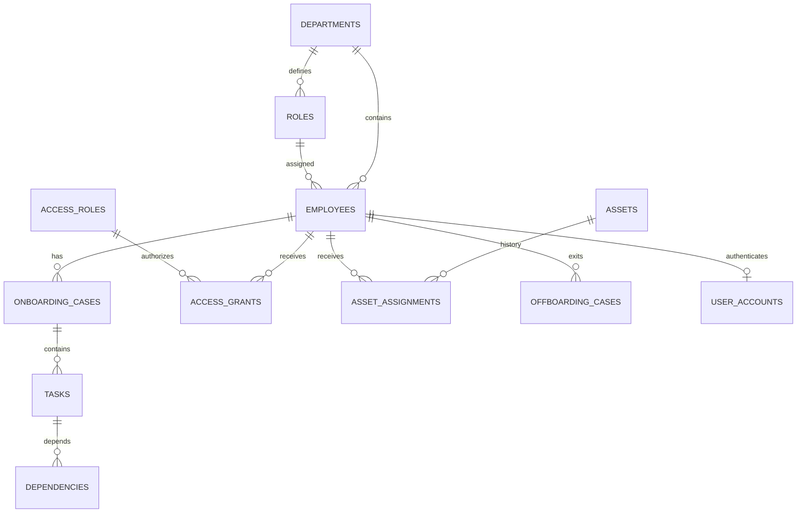

# ER diagram

```mermaid
erDiagram
 DEPARTMENTS ||--o{ EMPLOYEES : contains
 DEPARTMENTS ||--o{ ROLES : defines
 ROLES ||--o{ EMPLOYEES : assigned
 EMPLOYEES ||--o{ ONBOARDING_CASES : has
 ONBOARDING_CASES ||--o{ TASKS : contains
 TASKS ||--o{ DEPENDENCIES : depends
 EMPLOYEES ||--o{ ACCESS_GRANTS : receives
 ACCESS_ROLES ||--o{ ACCESS_GRANTS : authorizes
 ASSETS ||--o{ ASSET_ASSIGNMENTS : history
 EMPLOYEES ||--o{ ASSET_ASSIGNMENTS : receives
 EMPLOYEES ||--o{ OFFBOARDING_CASES : exits
 EMPLOYEES ||--o| USER_ACCOUNTS : authenticates
```
See schema.sql for current FK definitions.
